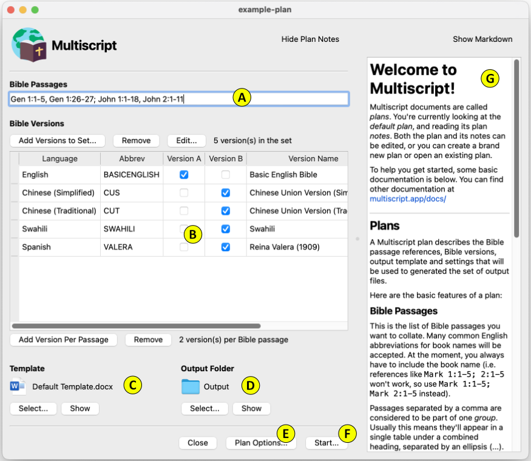

# Documentation
Multiscript documents are called *plans*. A Multiscript plan file describes the Bible passage references, Bible versions, output template and settings that will be used to generated the set of output files.

Here's an example Multiscript plan ([which you can download here](example-plan.mplan)):

Here are the basic features of a plan:

## **A** - Bible Passages
This is the list of Bible passages you want to collate. Many common English abbreviations for book names will be accepted. At the moment, you always have to include the book name (i.e. references like Mark 1:1-5; 2:1-5 won't work – use Mark 1:1-5; Mark 2:1-5 instead).

Passages separated by a comma are considered to be part of one *group*. Usually this means they'll appear in a single table under a combined heading, separated by continuation text (which by default is an ellipsis).

Passages separated by a semicolon are considered to be in separate groups (i.e. separate tables).

## **B** - Bible Versions
This is the list of versions you wish to combine. Click **Add Versions to Set** to add versions to the plan.

The version *columns* (i.e. Version A, Version B etc.) control how the versions are combined. It's easiest to think of each column in this list as a Bible passage column in your output document. You then tick which versions you want to appear in each column.

In the screenshot above, the English version is the only ticked version in column A, which means it will appear in every output document. All the other versions are ticked in column B. This will result in a series of files being generated, each of which have English and one of the other versions included per file.

You can have any number of columns (currently 1 to 26), and Multiscript will generate every possible combination for the versions and column ticks you enter.

You can double-click on any version to edit its labels, preferred font etc.

## **C** - Template
This is the template document that Multiscript will use to generate each output file.

### Tags

The template file should include any of the following tags. Around the tags you can include any other content that you like.

| Tag Text | Description |
|----------|-------------|
| **\[MSC_ALL_VERS_USER_LANG\]** | Inserts the list of all the version languages (using user labels) appearing in the output file. |
| **\[MSC_UNIQUE_VERS_USER_LANG\]** | Inserts the list of version languages (user user labels) for *unique* versions in the plan. In other words, this is the same as [MSC_ALL_VERS_USER_LANG\] except it ignores columns that have only one version ticked.|
| **\[MSC_VER_USER_LANG_X\]** | Inserts one version's language (user label), where X is the is the version column letter (e.g. A,B,C).|
| **\[MSC_ALL_TABLES\]** | The most useful tag. For each group of passages, inserts a passage header (\[MSC_PASSAGE_GROUP\] tag), followed by a table containing the Bible text (\[MSC_TEXT\] tags). The first table in the document includes an extra row at the top containing [MSC_VER_NAME\] tags.|
| **\[MSC_PASSAGE_GROUP_n\]** | Inserts the Bible passage reference for an entire group of passages (i.e. passages separated by commas), where n is group number (starting from 1).|
| **\[MSC_PASSAGE_n\]** | Inserts a single Bible passage reference, where n is the passage number (starting from 1, and ignoring any groups).|
| **\[MSC_VER_NAME_X\]** | Inserts the version's name, where X is the is the version column letter (e.g. A,B,C).|
| **\[MSC_TEXT_nX\]** | Inserts the actual Bible text, where n is the passage number (starting from 1, and ignoring any groups), and X is the is the version column letter (e.g. A,B,C).|
| **\[MSC_TEXT_JOIN\]** | Inserts the continuation text (which by default is an ellipsis). |
| **\[MSC_COPYRIGHT_X\]** | Insert the copyright text for one version, where X is the is the version column letter (e.g. A,B,C).|

### Styles

If your template is a Microsoft Word document, Multiscript will attempt to apply the following formatting styles. If you create styles with these names, you can control the formatting of the Multiscript output.

| Style Name | Description |
|------------|-------------|
| **MSC_Text_Table_Horiz** | Table style for horizontal table of Bible texts (created by \[MSC_ALL_TABLES\] tag). |
| **MSC_Passage_Group** | Paragraph style for a group of passage references (\[MSC_PASSAGE_GROUP\] tags). |
| **MSC_Version_Name** | Paragraph style for the Bible version's name (\[MSC_VER_NAME\] tags). |
| **MSC_Paragraph** | Paragraph style for Bible text (\[MSC_TEXT\] tags). |
| **MSC_Join** | Paragraph style for the continuation text (\[MSC_TEXT_JOIN\] tags). |
| **MSC_Copyright_Table_Horiz** | Table style for horizontal table of copyright texts. |
| **MSC_Copyright** | Style for the copyright text (\[MSC_COPYRIGHT\] tags). |
<!-- | MSC_Passage | Paragraph style for a single passage reference. | -->

### Fonts
You can specify a font name and font size for each version, that will be applied to the Bible text (overriding the MSC_Paragraph style). The [Google Noto project](https://fonts.google.com/noto) has fonts that cover a large number of the world's languages and scripts.

## **D** - Output Folder
This is the folder in which the output files will be generated.

## **E** - Plan Options
Click this button to adjust various settings specific to this plan file.

## **F** - Start
Click this button to execute the plan, which will generate the output files.